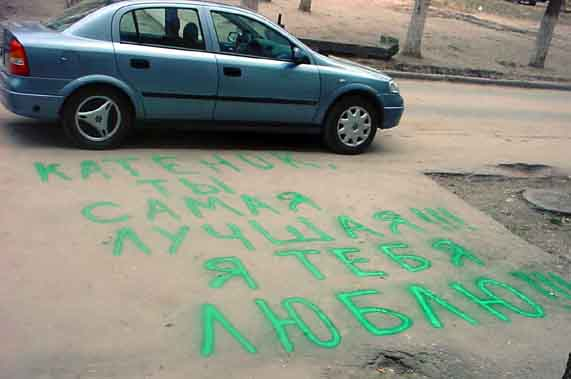

# [Миниатюры](../README.md) / Graphity

Graphity (англ, граффити) -  слышал, да не знал толком что это такое. Только что посмотрел в поисковой системе Google. Ни мало удивился, найдя как минимум по сто статей и на английском и на русском. Оказывается - это именно то, что я предполагал. Это стилизованная манера графического изображения, нередко – текстового, где броско и с принятыми экстравагантными условностями отображается запавшая в душу подробность,  будоражащая душу автора. Как правило, в людном месте. На заборе, на функциональном фронтоне здания, на тротуаре… Да простят мне составители подборки Google! Я все же даю собственную формулировку. Но просмотры в поисковой системе все же не напрасны – вряд ли я ошибся в формулировке. (Один из набитых приемов анализа сомнительной не всем известной информации). Слышал, что феноминальная коллекция Graphity была на громадной Берлинской стене, разделявшей… Ну сами знаете кого и от кого… Она в основном снесена вместе с изображениями. Подобное творчество я видел повсеместно не только в нашем городе, но и в большинстве столиц, которые удалось повидать. Так что не только примитив в подъезде нашего дома на улице Зорге в Ростове-на-Дону, не только в Москве, Петербурге, Ереване, Киеве, но и подальше… Что удивительно –  тематика в основном традиционна. Как следствие единой поп культуры сейчас в мире. Но совсем уж вызывающе для меня было увидеть на ангаре в международном аэропорту Бангкока надпись «Да здравствует король!» Причем на английском! Кстати, на английском в Тайланде говорят далеко не все. И даже работники международного аэропорта (уж не мешало бы!) по «аглицки» - не бе ни ме…!  Тайцы вообще-то относятся к своему королю трепетно. Не знаю уж, сопоставимы ли тут аналогии с Пхеньяном, в Северной Корее я не был (бог миловал). Но отношение тайцев к своему королю все же заслуживает уважения. Все же надпись на английском в Тайланде  предназначена для иностранцев и означает она признание того, что мол знайте как мы тут кого-то уважаем… Хотя примитивно. Прямо скажем. Как в русской присказке, когда алкоголики не минуют при контактах между собой вопроса «Ты меня уважаешь?!» После непродолжительных раздумий я все же склоняюсь к тому, что все граффити не взирая на географию происхождения грешит этим недугом.  Ну, пожалуй еще приглашением : «Ну разделите со мной восхищение… вот этим». Исключение составляет лишь творчество подобного рода в одном из публичных московских туалетов (мужских, естественно) на сексуальную тему. Были и такие в свое время. Сейчас в отличии от западных столиц почему-то платные, зачастую не менее грязные, но без этого… А там я просто поразился мастерству и откровенности. Именно графика (изображения, а не тексты!).

Ну, чисто для порядка, как не обойтись без экскурса в историю! Не будем брать Египет, это видели в репродукциях все, кто даже там и не был. Исписаны надписями и  примитивной стилизованной графикой гектары известняковых и даже базальтовых плит. Я по наивности раньше даже закосил на то, что этот недуг графоманов берет свое начало в древнем Египте.  Правда в морском порту Хургады я видел и живьем современные рисунки с весьма выраженным  арабским калоритом. Кстати, у них и яхты есть с названиями типа Алибаба или Синбад (мореход). И рисунки на борту весьма фривольного содержания (фривольный от англ free – свободный, от комплексов, очевидно). С тортами приписки Порт-Саид, Суэц, Александрия…

Да нет, не из Египта это развлечение. Хоть верьте, хоть нет, но в Северном национальном парке Сиднея (Новый Южный Уэльс, Австралия) я видел граффити, сделанное абориогенами 15 тыс. лет назад. Самое удивительное – это отполированное дно лужи на вершине горы, действительно иногда полу заполненное ежедневно высыхающей дождевой водой. Чистота такая, что 15 тыс лет ничего не заилилось, или как у нас в России – не загадилось! Там была изображена весьма реалистичная рыба, возможно, какое-то земноводное. Возможно и поймали её (его) в одной из этих луж и на радостях на сытый желудок изобразили на камне, по технологиям, которые заимствовал прогрессивный для того времени нарождающийся прогрессивный для своего времени рабовладельческий строй древнего Египта. Когда, как? - читайте «Путешествие па Кон-Тики», Тур Хейердал.) Когда в древнем Египте еще только готовились предпосылки к свершению рабовладельческой революции и в недрах первобытно общинной формации еще не зародились предпосылки к излишествам столь утонченного искусства. (Извините, марксизм – куда же денешься от исторического материализма!) 

В современных аэропортах, в Сингапуре, например, закуришь в неположенном месте – штраф 150 баксов, а это – есть, кто бы мог подумать?! Азиатское, однако, мироощущение, не чуждо просвященному дикарству, как в Европе, Африке, Австралии. И культ личности тайского короля вроде бы здесь не причем. Это не там, значительно южнее, 200 км от экватора.  

Технологии вполне современные. Аэрозоли, многоцветная палитра, оттенки с градиентами, обводки. Мы (они то бишь) не лыком шиты. 

Ну а теперь проза жизненная. Что же меня навело на мысль все это написать? Проще, чем может показаться. Три дня назад я увидел то, за чем не следовало углубляться в воспоминания пары десятков лет. Выхожу их подъезда и вижу на асфальте прямо перед своим домом на тротуаре надпись буквально следующего содержания:

```
КАТЁНОК,
      ТЫ
      САМАЯ
ЛУЧШАЯ!!!
Я ТЕБЯ
ЛЮБЛЮ!!!
```

Сфотографировал даже на память. Чтобы попозже на досуге проанализировать текст. Не зря, однако. Сейчас пойду возьму из машины фотоаппарат, так как не уверен, правильно и дословно ли запомнил текст. 

Да, все правильно. Вот эта фотография, если читатель пользуется электронной версией моего повествования, то посмотрите графический файл приложения:

 

Честно говоря, для меня это было несколько неожиданно. Кому писали, и кто писал – не знаю. Очевидно, что удачливый вздыхатель одной из моих соседок по подъезду. Почему удачливый? Да из текста видно. Что переполнен эмоциями и вдохновлен достижениями на личном фронте. И все же, в связи с вышеизложенным, а также в соответствии с имеющимися в мой адрес упреками в том, что «разбираю все по косточкам», я сделал вышеизложенную прелюдию, чтобы показать хотя бы то, что случай далеко не оригинальный, имевший место быть везде и во все века. 

Художественной, эстетической ценности послание не имеет, это очевидно из фотографии. Этический же и психологический момент является не более, чем предметом домысла. На что автор, собственно и рассчитывал. Кроме того, как и в случае с королем в Тайланде, явно дается понять, что посторонних он не стесняется. С этической точки зрения не так и оригинально. «Нам целый мир чужбина, отечество нам Царское Село» - неплохой пример не замечать, возможно лучшего, если речь идет в цитате « о целом мире», а в оригинальнм тексте о “самой» из… А вот далее, на мой взгляд психологический пролет. «Ты самая лучшая!!!» То есть автор допускает возможность сравнения… И очевидно, что не смотря на восторженность и максимализм сравнивать было с кем. Иначе бы не писал. И непосредственному адресату это должно быть очевидно. Дальше в лес – больше дров. Был, не мог не быть опыт и  «с не самой лучшей». А вот это уже адресату может не понравиться. Ну а стандартная концовка? Насчет скромности, не говоря уже о незыблемой уверенности в своих чувствах? Я бы, например, сто раз готовый к признанию, все же многократно подумал, прежде чем облекать это в столь голую бескомпромиссную формулу. Ну, и , конечно – не на тротуаре. Даже в письме как-то не всегда уверен, что можно, что необходимо, что пора, в конце концов.  Хотя бы потому, что всегда боюсь, что не так понят буду. Или не вовремя, или с недостаточными основаниями (хотя также, как и он, от достигнутого, конечно и решение…)  Думаю, что это все же не на публику как с Тайским королем, а просто  зря. А коль так, то далеко не продвинет. Почти уверен, что Катенок рано или поздно это почувствует, если не поймет сразу. Но это мало вероятно, что поймет. 

Софистика, натяжки? Возможно! Выдавать домыслы за прогнозы? Два факта, один из которых хорошо известен тем, кто в сознательном возрасте жил в Советской России до 1990 года. Да, я имею в виду демонстрации трудящихся, когда было принято носить, в том числе и громадные портреты членов политбюро. Иконостасы, как иногда это называли в верхних эшелонах номенклатуры.  Это граффити? Думаю, что в некотором роде да! Или тексты типа «живее всех живых», “ум, честь и совесть нашей эпохи»,  « выдающийся деятель современности» (когда речь шла о практически впавшем в маразм пожилом больном человеке). 

И второй факт, известный всего нескольким людям. В начале августа 1968 года я сам лично написал по-английски на асфальте мелом в своем дворе на Доломановском: «Всего наилучшего. Только 5 (отлично)!». Две мои весьма близкие знакомые сдавали в этот день приемные экзамены на факультет иностранных языков в Пединститут. Потому и на английском. Лет пять назад, одна из них, жена моего друга, таки вспомнила это без всякой на то очевидной причины. Вторая была замужем за вторым моим другом.  Об этом, возможна другая миниатюра. У них в тот день все получилось действительно отлично. Не все, возможно в жизни многие годы было на отлично. А я тогда думал, вернее не думал, наверное, ни о чем, так же, как и  знакомый Катёнка несколько дней назад.

Так, что и эти два факта есть пример массового помешательства, неестественное, ненужное, домыслы, прогнозы софистика, переворачивание с головы на ноги очевидного? Да нет, скорее всего, это тотальная бесхребетность, несерьезность, эмоциональная неуравновешенность.  Только позавидовать остается тем, у кого все заранее разложено по полочкам?  Да и разложить, как правило,  не удается.  Мне, по крайней мере.  


10 апреля 2009 
yury
